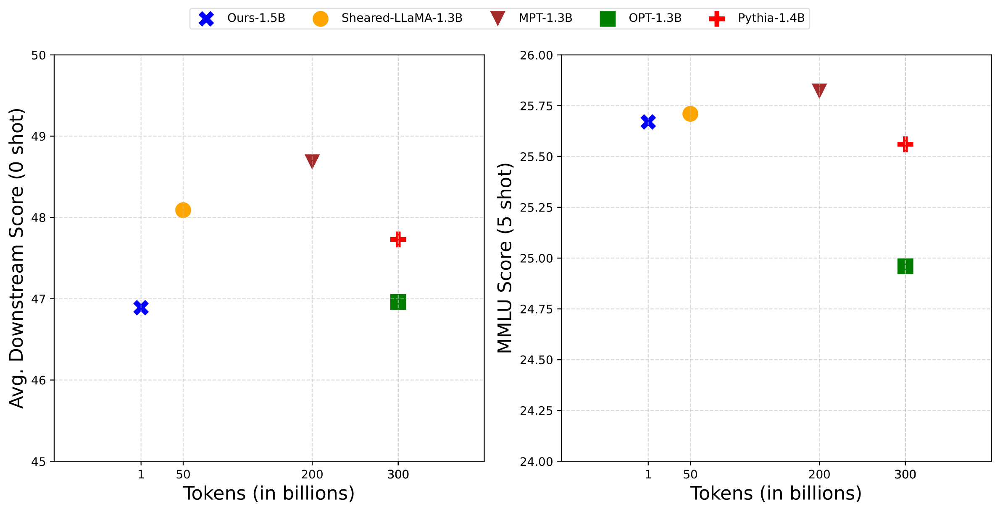

# Pre-training Small Base LMs with Fewer Tokens

<p align="center" width="50%">
      
</p>

[Paper](https://arxiv.org/abs/2404.08634) | [Tweet](https://x.com/SunnySanyal9/status/1779700347335741622) | [Podcast](https://open.spotify.com/episode/4DvCmbTEH35D8UvxrdNPv6)


[//]: # (⚠️ **Warning**)

[//]: # ()
[//]: # (This repository is still under development and may still contain various bugs.)

[//]: # (---)
This is the official repository for the paper [Pre-training Small Base LMs with Fewer Tokens](https://arxiv.org/abs/2404.08634). 

## Abstract
We study the effectiveness of a simple approach to develop a small base language model (LM) starting from an existing large base LM: first inherit a few transformer blocks from the larger LM, and then continually train this smaller model on a very small subset (0.1%) of the raw pre-training data of the larger model. We call our simple recipe Inheritune and first demonstrate it for building a small base LM with 1.5B parameters using 1B tokens (and a starting larger LM of 3B parameters); we do this using a single A6000 GPU for less than half a day. Across 9 diverse evaluation datasets as well as the MMLU benchmark, the resulting model compares favorably to publicly available similar sized base models, some of which have been trained using 50-1000 times more tokens. 

We also investigate Inheritune, a slightly different setting where we train small LMs utilizing larger LMs and their full pre-training dataset. Here we show that smaller LMs trained utilizing some of the layers of GPT2-medium (355M) and GPT-2-large (770M) can effectively match the validation loss of their bigger counterparts when trained from scratch for the same number of training steps on OpenWebText dataset with 9B tokens. We analyze Inheritune with extensive experiments and demonstrate it efficacy on diverse settings.

## Train 1.5B base language model using 1B tokens with 1 GPU for half a day

Performance of our 1.5B base LM derived using 1B data with Inheritune on an average of 9 different datasets (left) and MMLU benchmark (right) that evaluates commonsense, truthfulness, natural language inference and language understanding. We compare our model's performance with reference model-OpenLLamA-3B (2x size), other small base LMs of size 1B-2B parameters such as MPT-1.3B, OPT-1.3B, Pythia-1.4B (pre-trained from scratch) and  ShearLLaMA-1.5B (pruned and continually trained using existing large base LM).


&nbsp;

<p align="center" width="50%">
      
</p>


### Table of Results

Below is the comparison of our target model with reference models and other baseline models of similar size when pre-trained from scratch and pre-trained with inherited weights and pruning. Our model, although trained with fewer tokens, achieves comparable performance. We have highlighted all scores where our model achieves at least 90% of the score compared to its reference language model or outperforms at least two of the baseline models. All tasks are evaluated using 0-shot except MMLU, which is 5-shot. The models marked with n/a are trained from scratch.

#### Commonsense Reasoning
<table>
<tr>
<th colspan="2"><b>Model</b></th>
<th colspan="5"><b>Commonsense Reasoning</b></th>
</tr>
<tr>
<td><b>Name (# train tokens)</b></td>
<td><b>Reference</b></td>
<td><b>Winograd</b></td>
<td><b>PIQA</b></td>
<td><b>Boolq</b></td>
<td><b>WinoGrande</b></td>
<td><b>Logiqa</b></td>
</tr>
<tr>
<td>OpenLLaMA-3B (1T)</td>
<td>n/a</td>
<td>63.46</td>
<td>74.97</td>
<td>67.18</td>
<td>62.27</td>
<td>28.4</td>
</tr>
<tr>
<td>OPT-1.3B (300B)</td>
<td>n/a</td>
<td>38.46</td>
<td>71.82</td>
<td>57.83</td>
<td>59.51</td>
<td>27.04</td>
</tr>
<tr>
<td>Pythia-1.4B (300B)</td>
<td>n/a</td>
<td>36.54</td>
<td>70.89</td>
<td>63.12</td>
<td>56.99</td>
<td>27.65</td>
</tr>
<tr>
<td>MPT-1.3B (200B)</td>
<td>n/a</td>
<td>63.46</td>
<td>71.44</td>
<td>50.89</td>
<td>58.09</td>
<td>28.26</td>
</tr>
<tr>
<td>Sheared LLaMA-1.3B (50B)</td>
<td>LLaMA2-7B</td>
<td>36.54</td>
<td>73.45</td>
<td>62.02</td>
<td>58.17</td>
<td>27.34</td>
</tr>
<tr>
<td><b>Ours-1.5B (1B)</b></td>
<td>OpenLLaMA-3B</td>
<td><b>50.96</b></td>
<td>56.47</td>
<td><b>61.68</b></td>
<td>51.69</td>
<td>25.19</td>
</tr>
</table>

#### Language Understanding, Inference &  Factuality
<table>
<tr>
<th colspan="2"><b>Model</b></th>
<th colspan="4"><b>Lang. Understanding & Inference</b></th>
<th><b>Factuality</b></th>
</tr>
<tr>
<td><b>Name (# train tokens)</b></td>
<td><b>Reference</b></td>
<td><b>MMLU(5)</b></td>
<td><b>WNLI</b></td>
<td><b>QNLI</b></td>
<td><b>MNLI</b></td>
<td><b>TruthfulQA</b></td>
</tr>
<tr>
<td>OpenLLaMA-3B (1T)</td>
<td>n/a</td>
<td>27.21</td>
<td>50.7</td>
<td>51.3</td>
<td>37.3</td>
<td>35</td>
</tr>
<tr>
<td>OPT-1.3B (300B)</td>
<td>n/a</td>
<td>24.96</td>
<td>42.25</td>
<td>51.29</td>
<td>35.82</td>
<td>38.67</td>
</tr>
<tr>
<td>Pythia-1.4B (300B)</td>
<td>n/a</td>
<td>25.56</td>
<td>53.52</td>
<td>49.48</td>
<td>32.76</td>
<td>38.66</td>
</tr>
<tr>
<td>MPT-1.3B (200B)</td>
<td>n/a</td>
<td>25.82</td>
<td>40.85</td>
<td>50.52</td>
<td>35.93</td>
<td>38.68</td>
</tr>
<tr>
<td>Sheared LLaMA-1.3B (50B)</td>
<td>LLaMA2-7B</td>
<td>25.71</td>
<td>49.3</td>
<td>50.98</td>
<td>37.94</td>
<td>37.14</td>
</tr>
<tr>
<td><b>Ours-1.5B (1B)</b></td>
<td>OpenLLaMA-3B</td>
<td><b>25.67</b></td>
<td><b>43.66</b></td>
<td><b>49.41</b></td>
<td><b>34.42</b></td>
<td><b>48.61</b></td>
</tr>
</table>

## Exploratory Analysis with GPT2-large(770M) and GPT2-medium(355M)

&nbsp;

Below is the pre-training and downstream performance of GPT-2 Medium and Large models, evaluated using validation loss, Wikitext, and Lambada OpenAI downstream tasks. Smaller models derived using our method perform comparably to their full-sized counterparts. Models initialized with our method show better performance than those with random initialization.

<table>
<thead>
<tr>
<th rowspan="2">Models</th>
<th rowspan="2">Layers</th>
<th rowspan="2">Initialization</th>
<th rowspan="2">Steps</th>
<th rowspan="2">Pre-train Val Loss (↓)</th>
<th colspan="2">Downstream (0-shot)</th>
</tr>
<tr>
<th>Wikitext (↓)</th>
<th>Lambada</th>
</tr>
</thead>
<tbody>
<tr>
<td rowspan="4">GPT-2 Large</td>
<td>36</td>
<td>rand init</td>
<td>100K</td>
<td>2.85</td>
<td>34.84</td>
<td>34.14</td>
</tr>
<tr>
<td>18</td>
<td>rand init</td>
<td>100K</td>
<td>2.97</td>
<td>37.63</td>
<td>30.97</td>
</tr>
<tr>
<td>18</td>
<td>rand init</td>
<td>200K</td>
<td>2.84</td>
<td>--</td>
<td>--</td>
</tr>
<tr>
<td>18</td>
<td>Ours</td>
<td>100K</td>
<td><strong>2.80</strong></td>
<td>35.38</td>
<td>34.64</td>
</tr>
<tr>
<td rowspan="5">GPT-2 Medium</td>
<td>24</td>
<td>rand init</td>
<td>100K</td>
<td>2.81</td>
<td>31.93</td>
<td>36.54</td>
</tr>
<tr>
<td>16</td>
<td>rand init</td>
<td>100K</td>
<td>2.86</td>
<td>33.67</td>
<td>34.60</td>
</tr>
<tr>
<td>16</td>
<td>rand init</td>
<td>200K</td>
<td>2.83</td>
<td>--</td>
<td>--</td>
</tr>
<tr>
<td>12</td>
<td>Ours</td>
<td>100K</td>
<td>2.87</td>
<td>--</td>
<td>--</td>
</tr>
<tr>
<td>14</td>
<td>Ours</td>
<td>100K</td>
<td>2.84</td>
<td>--</td>
<td>--</td>
</tr>
<tr>
<td><strong>Final Model →</strong></td>
<td>16</td>
<td>Ours</td>
<td>100K</td>
<td><strong>2.81</strong></td>
<td>32.04</td>
<td>35.96</td>
</tr>
</tbody>
</table>

Note: The models marked with 'rand init' are randomly initialized. The row labeled 'Final Model →' indicates the end results after 3 rounds of our method on a GPT-2 medium model to achieve benchmark val loss.


## Cite us 
If you find this work helpful, please consider citing us:

```
@inproceedings{Sanyal2024pretraining,
  title  = {Pre-training Small Base LMs with Fewer Tokens},
  author = {Sunny Sanyal and sujay sanghavi and Alex Dimakis},
  year   = {2024}
}
```
&nbsp;

## Acknowledgement
The training code for small language model 1B-2B is mainly adapted from [litgpt](https://github.com/Lightning-AI/litgpt/blob/main/README.md). The code for GPT2 experiments are mainly adapted from [Sophia](https://github.com/Liuhong99/Sophia/) and [nanoGPT](https://github.com/karpathy/nanoGPT/). \
The llama image is created using DALLE.
