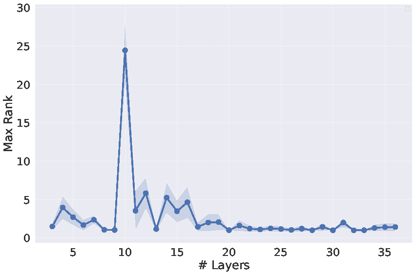
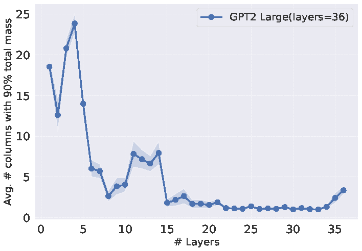
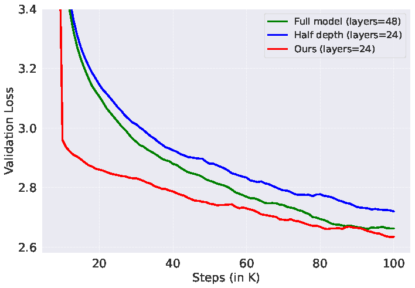
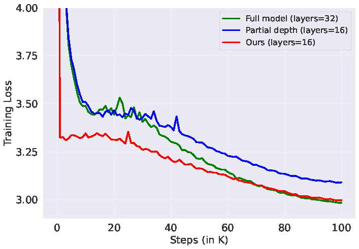

# Pre-training Small Base LMs with Fewer Tokens

<p align="center" width="50%">
      
</p>

[//]: # ([Paper]&#40;https://arxiv.org/abs/2404.08634&#41; )

[//]: # (| [Tweet]&#40;https://x.com/SunnySanyal9/status/1779700347335741622&#41; | [Podcast]&#40;https://open.spotify.com/episode/4DvCmbTEH35D8UvxrdNPv6&#41; | [Media]&#40;https://www.marktechpost.com/2024/04/21/inheritune-by-ut-austin-assists-efficient-language-model-training-leveraging-inheritance-and-reduced-data-for-comparable-performance/&#41;)


⚠️ **Warning**

[//]: # ()
This repository is still under development and may still contain various bugs.

[//]: # (---)
This is the official repository for the paper [Inheritune: Training Smaller Yet More Attentive Language Models](https://arxiv.org/abs/2404.08634). 

## Abstract
Large Language Models (LLMs) have achieved remarkable performance across various natural language processing tasks, primarily due to the transformer architecture and its self-attention mechanism. However, we observe that in standard decoder-style LLMs, attention matrices degenerate to single-column for deeper layers. Layers in this state are unable to learn anything meaningful and mostly redundant; we refer to these as \emph{lazy layers}. The goal of this paper is to train smaller models by eliminating this structural inefficiency without compromising performance.

Motivated by this observation, we propose \textbf{Inheritune}, a simple yet effective training recipe for developing smaller, high-performing language models. Smaller models trained with \method{} inherit early transformer layers from a larger pre-trained model, then retrain and progressively expand until they match or exceed the performance of the larger model. We demonstrate that \method{} enables the training of various sizes of GPT-2 models on datasets like OpenWebText-9B and FineWeb\_Edu. Models trained with \method{}, despite having significantly fewer layers, match or even surpass the performance of their larger counterparts. For instance, our 16-layer GPT-2 medium variant achieves comparable performance to the standard 24-layer GPT-2 medium model.

## Attention Degeneration in Standard Decoder style-LLMs

<br><br>

<p align="center" width="30%">
      
</p>

<p align="center" width="30%">
      An analysis of a 36-layer GPT-2 large shows the max rank of the attention matrices across all layers.
</p>

<br><br>


<p align="center" width="30%">
      
</p>

<p align="center" width="30%">
      A closer look at the same GPT-2 large model reveals that the dominant mass proportion of several attention matrices is concentrated in a single column, particularly in deeper layers.

</p>


## Main Result: Training GPT-2 xlarge (1.5B) with OpenWebText-9B tokens

 Model derived using Inheritune converges faster and matches the final validation loss of the full-sized model trained from scratch, despite being smaller. Training GPT-2 xlarge vanilla models from scratch and our variants with OpenWebText-9B for 100K steps.

&nbsp;

<p align="center" width="30%">
      
</p>

## Additional Result: Training GPT-2 large* (680M) with Fineweb_edu

Models derived using Inheritune converge faster and match the final validation loss of the full-sized model despite using fewer layers.

<p align="center" width="30%">
      
</p>

## Downstream Performance of Models Trained with Fineweb_edu

| Models             | Recipe     | Layers | ARCE (acc) | PIQA (acc) | SciQ (acc) | Hellaswag (acc norm) | Lambada (acc) | **Average** |
|--------------------|------------|--------|------------|------------|------------|----------------------|---------------|------------|
| **GPT-2 Medium**   |            |        |            |            |            |                      |               |            |
| &nbsp;&nbsp;       | rand init  | 24     | 51.05      | 61.81      | 74.8       | 30.79                | 20.28         | 47.74      |
| &nbsp;&nbsp;       | rand init  | 16     | 49.92      | 61.92      | 73.3       | 29.56                | 19.54         | 46.84      |
| &nbsp;&nbsp;       | **Ours**   | 16     | **51.26**  | **61.81**  | **73.8**   | **30.55**            | **23**        | **48.08**  |
| **GPT-2 Large**<sup>†</sup> |   |        |            |            |            |                      |               |            |
| &nbsp;&nbsp;       | rand init  | 32     | 52.48      | 64.58      | 75.3       | 32.65                | 22.2          | 49.44      |
| &nbsp;&nbsp;       | rand init  | 16     | 50.34      | 63.11      | 75         | 30.86                | 21.56         | 48.17      |
| &nbsp;&nbsp;       | **Ours**   | 16     | **52.9**   | **63.55**  | **76.1**   | **32.14**            | **24.06**     | **49.75**  |


**Models trained with Inheritune outperform both their larger and same-size counterparts trained from scratch on average zero-shot downstream performance.**

For evaluation, we use accuracy (acc) and normalized accuracy (acc norm) metrics following the Open LLM leaderboard. All models are trained with `FineWeb_edu`.

## Additional Experiments in Low Data Regime

### Train 1.5B base language model using 1B tokens with 1 GPU for half a day

Performance of our 1.5B base LM derived using 1B data with Inheritune on an average of 9 different datasets (left) and MMLU benchmark (right) that evaluates commonsense, truthfulness, natural language inference and language understanding. We compare our model's performance with reference model-OpenLLamA-3B (2x size), other small base LMs of size 1B-2B parameters such as MPT-1.3B, OPT-1.3B, Pythia-1.4B (pre-trained from scratch) and  ShearLLaMA-1.5B (pruned and continually trained using existing large base LM).


&nbsp;

<p align="center" width="50%">
      
</p>


### Table of Results

Below is the comparison of our target model with reference models and other baseline models of similar size when pre-trained from scratch and pre-trained with inherited weights and pruning. Our model, although trained with fewer tokens, achieves comparable performance. We have highlighted all scores where our model achieves at least 90% of the score compared to its reference language model or outperforms at least two of the baseline models. All tasks are evaluated using 0-shot except MMLU, which is 5-shot. The models marked with n/a are trained from scratch.

#### Commonsense Reasoning
<table>
<tr>
<th colspan="2"><b>Model</b></th>
<th colspan="5"><b>Commonsense Reasoning</b></th>
</tr>
<tr>
<td><b>Name (# train tokens)</b></td>
<td><b>Reference</b></td>
<td><b>Winograd</b></td>
<td><b>PIQA</b></td>
<td><b>Boolq</b></td>
<td><b>WinoGrande</b></td>
<td><b>Logiqa</b></td>
</tr>
<tr>
<td>OpenLLaMA-3B (1T)</td>
<td>n/a</td>
<td>63.46</td>
<td>74.97</td>
<td>67.18</td>
<td>62.27</td>
<td>28.4</td>
</tr>
<tr>
<td>OPT-1.3B (300B)</td>
<td>n/a</td>
<td>38.46</td>
<td>71.82</td>
<td>57.83</td>
<td>59.51</td>
<td>27.04</td>
</tr>
<tr>
<td>Pythia-1.4B (300B)</td>
<td>n/a</td>
<td>36.54</td>
<td>70.89</td>
<td>63.12</td>
<td>56.99</td>
<td>27.65</td>
</tr>
<tr>
<td>MPT-1.3B (200B)</td>
<td>n/a</td>
<td>63.46</td>
<td>71.44</td>
<td>50.89</td>
<td>58.09</td>
<td>28.26</td>
</tr>
<tr>
<td>Sheared LLaMA-1.3B (50B)</td>
<td>LLaMA2-7B</td>
<td>36.54</td>
<td>73.45</td>
<td>62.02</td>
<td>58.17</td>
<td>27.34</td>
</tr>
<tr>
<td><b>Ours-1.5B (1B)</b></td>
<td>OpenLLaMA-3B</td>
<td><b>50.96</b></td>
<td>56.47</td>
<td><b>61.68</b></td>
<td>51.69</td>
<td>25.19</td>
</tr>
</table>

#### Language Understanding, Inference &  Factuality
<table>
<tr>
<th colspan="2"><b>Model</b></th>
<th colspan="4"><b>Lang. Understanding & Inference</b></th>
<th><b>Factuality</b></th>
</tr>
<tr>
<td><b>Name (# train tokens)</b></td>
<td><b>Reference</b></td>
<td><b>MMLU(5)</b></td>
<td><b>WNLI</b></td>
<td><b>QNLI</b></td>
<td><b>MNLI</b></td>
<td><b>TruthfulQA</b></td>
</tr>
<tr>
<td>OpenLLaMA-3B (1T)</td>
<td>n/a</td>
<td>27.21</td>
<td>50.7</td>
<td>51.3</td>
<td>37.3</td>
<td>35</td>
</tr>
<tr>
<td>OPT-1.3B (300B)</td>
<td>n/a</td>
<td>24.96</td>
<td>42.25</td>
<td>51.29</td>
<td>35.82</td>
<td>38.67</td>
</tr>
<tr>
<td>Pythia-1.4B (300B)</td>
<td>n/a</td>
<td>25.56</td>
<td>53.52</td>
<td>49.48</td>
<td>32.76</td>
<td>38.66</td>
</tr>
<tr>
<td>MPT-1.3B (200B)</td>
<td>n/a</td>
<td>25.82</td>
<td>40.85</td>
<td>50.52</td>
<td>35.93</td>
<td>38.68</td>
</tr>
<tr>
<td>Sheared LLaMA-1.3B (50B)</td>
<td>LLaMA2-7B</td>
<td>25.71</td>
<td>49.3</td>
<td>50.98</td>
<td>37.94</td>
<td>37.14</td>
</tr>
<tr>
<td><b>Ours-1.5B (1B)</b></td>
<td>OpenLLaMA-3B</td>
<td><b>25.67</b></td>
<td><b>43.66</b></td>
<td><b>49.41</b></td>
<td><b>34.42</b></td>
<td><b>48.61</b></td>
</tr>
</table>

&nbsp;


## News

[2024-04-22] We've released the first version of codebase for Inheritune in low data regime and also full data regime.

[2024-04-22] We've added the discussions option at the top for community feedback and discussions. Feel free to suggest new experiments and post your results.


## Cite us 
If you find this work helpful, please consider citing us:

```
@inproceedings{Sanyal2024pretraining,
  title  = {Pre-training Small Base LMs with Fewer Tokens},
  author = {Sunny Sanyal and Sujay Sanghavi and Alexandros G. Dimakis},
  year   = {2024},
  url={https://arxiv.org/abs/2404.08634}
  
}
```
&nbsp;

## Acknowledgement
The training code for small language model 1B-2B is mainly adapted from [litgpt](https://github.com/Lightning-AI/litgpt/blob/main/README.md). The code for GPT2 experiments are mainly adapted from [Sophia](https://github.com/Liuhong99/Sophia/) and [nanoGPT](https://github.com/karpathy/nanoGPT/). \
The llama image is created using DALLE.
