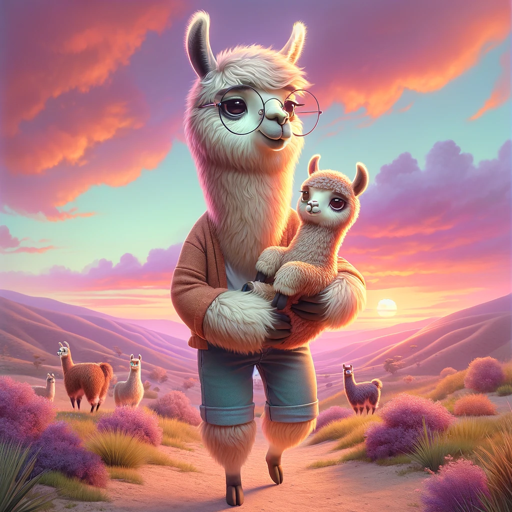

# Pre-training Small Base LMs with Fewer Tokens

<p align="center" width="50%">
      
</p>

[Paper](https://arxiv.org/abs/2404.08634) | [Tweet](https://x.com/SunnySanyal9/status/1779700347335741622) | [Podcast](https://open.spotify.com/episode/4DvCmbTEH35D8UvxrdNPv6)


⚠️ **Warning**

This repository is still under development and may still contain various bugs.
---


## Abstract
We study the effectiveness of a simple approach to develop a small base language model (LM) starting from an existing large base LM: first inherit a few transformer blocks from the larger LM, and then continually train this smaller model on a very small subset (0.1%) of the raw pre-training data of the larger model. We call our simple recipe Inheritune and first demonstrate it for building a small base LM with 1.5B parameters using 1B tokens (and a starting larger LM of 3B parameters); we do this using a single A6000 GPU for less than half a day. Across 9 diverse evaluation datasets as well as the MMLU benchmark, the resulting model compares favorably to publicly available similar sized base models, some of which have been trained using 50-1000 times more tokens. 

We also investigate Inheritune, a slightly different setting where we train small LMs utilizing larger LMs and their full pre-training dataset. Here we show that smaller LMs trained utilizing some of the layers of GPT2-medium (355M) and GPT-2-large (770M) can effectively match the validation loss of their bigger counterparts when trained from scratch for the same number of training steps on OpenWebText dataset with 9B tokens. We analyze \method{} with extensive experiments and demonstrate it efficacy on diverse settings.

## Cite us 
If you find this work helpful, please consider citing us:

```
@inproceedings{Sanyal2024pretraining,
  title  = {Pre-training Small Base LMs with Fewer Tokens},
  author = {Sunny Sanyal and sujay sanghavi and Alex Dimakis},
  year   = {2024}
}
```
&nbsp;

## Acknowledgement
The training code for small language model 1B-2B is mainly adapted from [litgpt](https://github.com/Lightning-AI/litgpt/blob/main/README.md). The code for GPT2 experiments are mainly adapted from [Sophia](https://github.com/Liuhong99/Sophia/) and [nanoGPT](https://github.com/karpathy/nanoGPT/). \
The llama image is created using DALLE.
