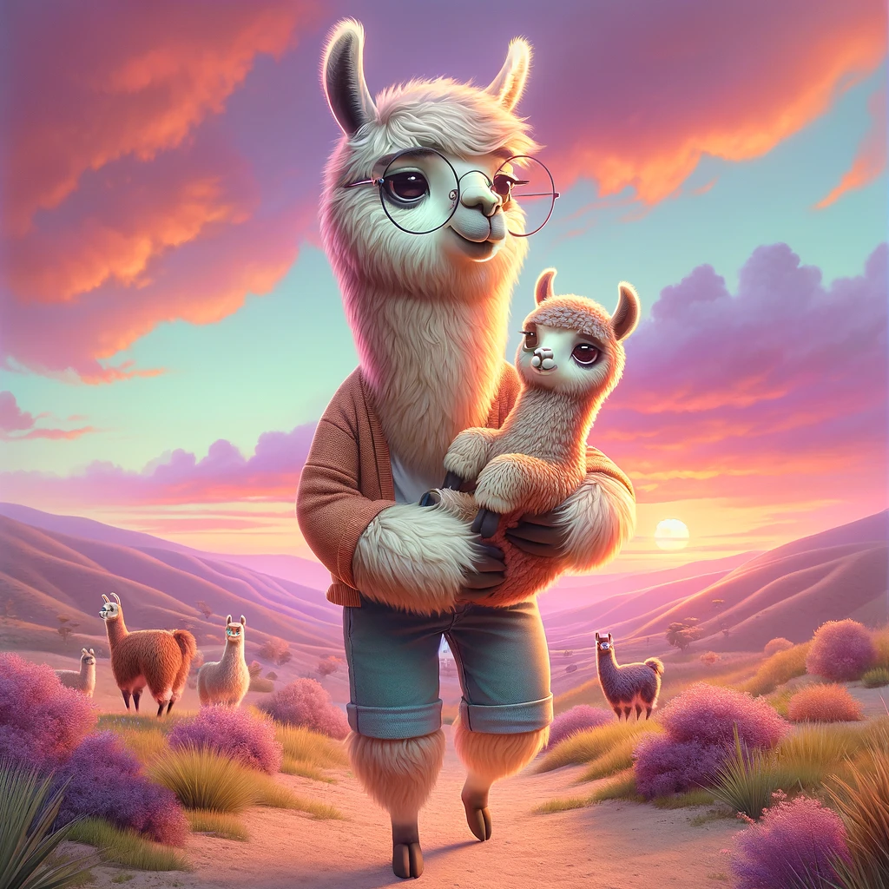
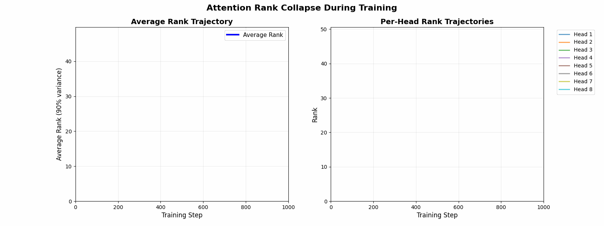
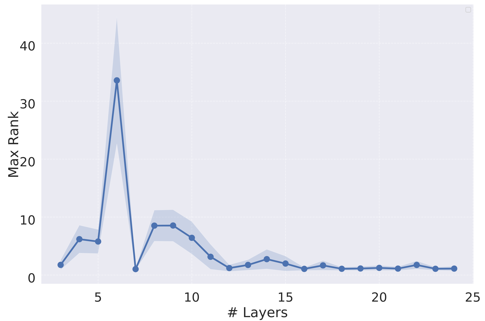
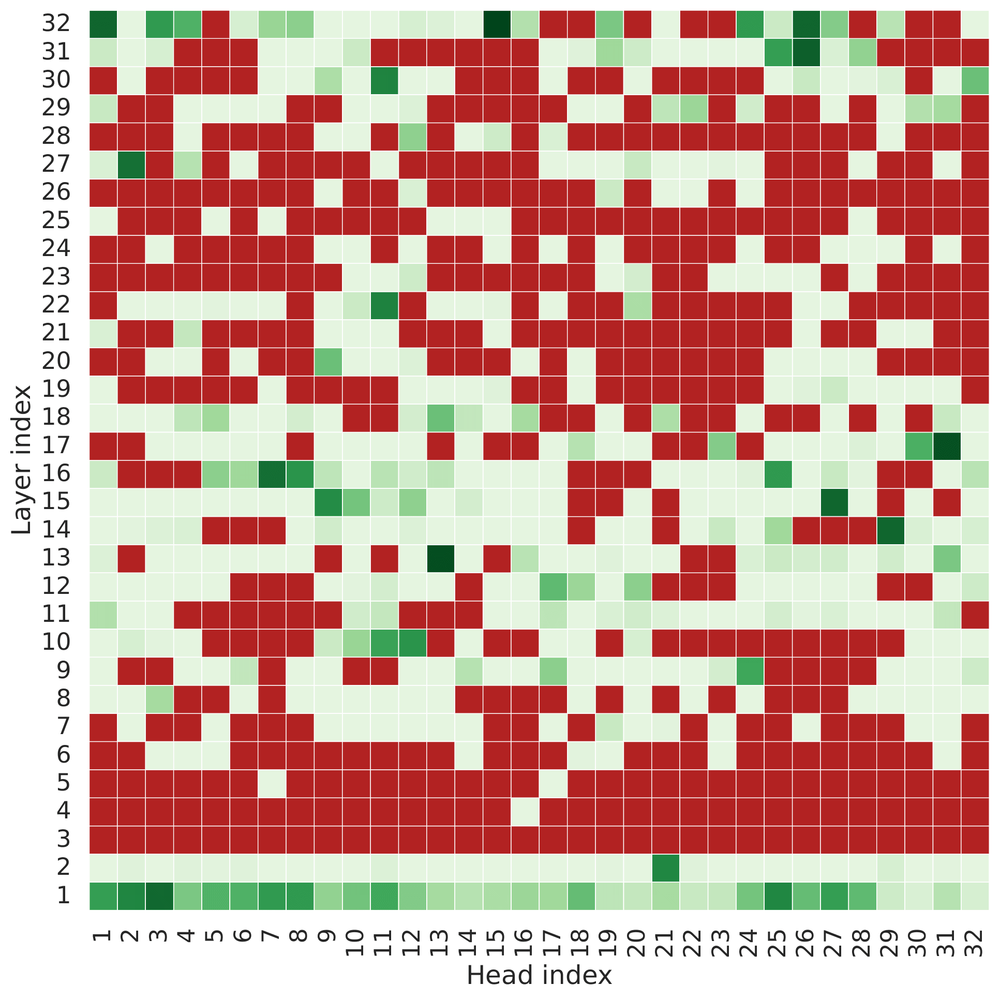
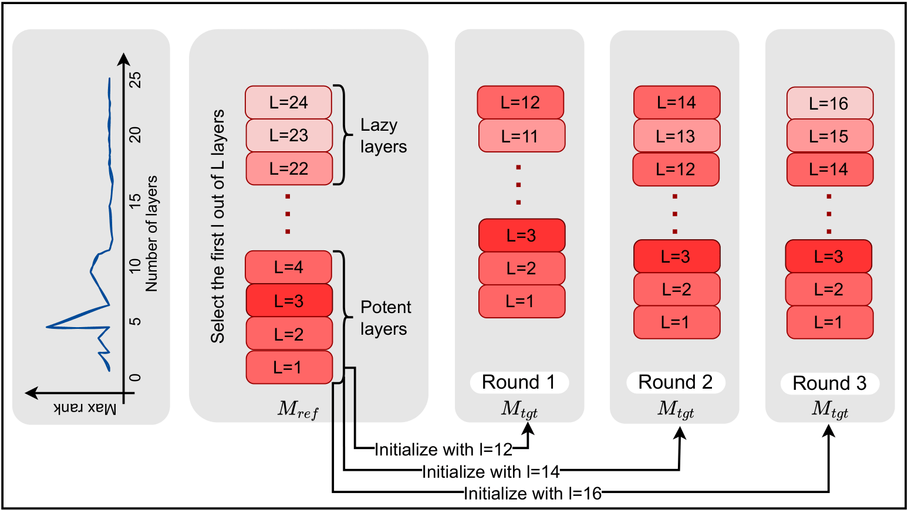
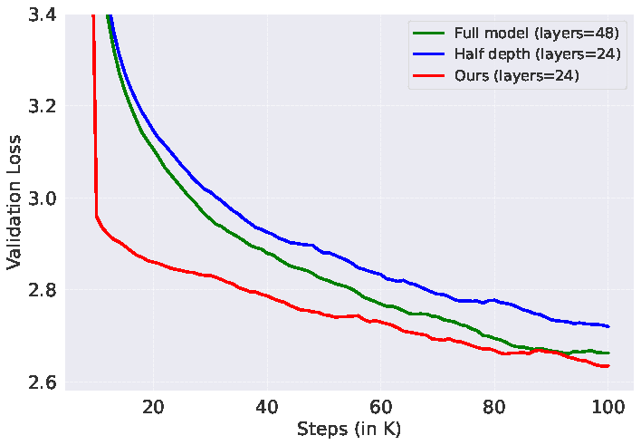
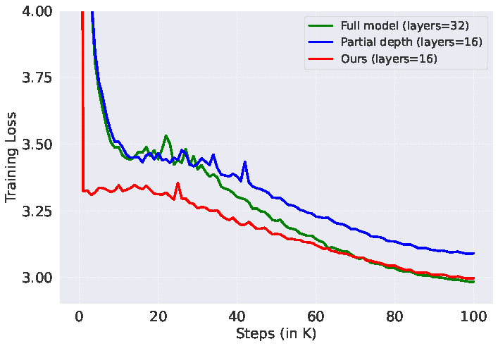

# When Attention Collapses: How Degenerate Layers in LLMs Enable Smaller, Stronger Models

[](LICENSE)
[](https://arxiv.org/abs/2404.08634)


<p align="center">
  
</p>

[//]: # (<p align="center">)

[//]: # (  <a href="https://arxiv.org/abs/2404.08634">📄 Paper</a> •)

[//]: # (  <a href="#quick-start">🚀 Quick Start</a> •)

[//]: # (  <a href="#results">📊 Results</a> •)

[//]: # (  <a href="#citation">📖 Citation</a>)

[//]: # (</p>)

---

## Overview

>This paper was formerly known as 
>* Inheritune: Training Smaller Yet More Attentive Language Models  (v2)
>* Pre-training Small Base LMs with Fewer Tokens (v1)

**Inheritune** is an efficient training method for developing smaller, high-performing language models by inheriting knowledge from larger pre-trained models. Our approach addresses a critical inefficiency in standard transformer architectures: attention matrices in deeper layers often degenerate to single-column patterns, creating "lazy layers" that contribute minimally to model performance.

This paper has been published as a journal version in **TMLR** and was reviewed on [OpenReview](https://openreview.net/forum?id=2zQn0bUoPf).


## Selected Impacts

- 📌 **Used in the wild:** This paper is used by **21 Hugging Face models** ([HuggingFace page](https://huggingface.co/papers/2404.08634)).
- 🌍 **Notable adoption:** **Gumini (multilingual)** English and Korean models are trained following the **Inheritune** recipe ([Gumini report](https://huggingface.co/spaces/GuminiResearch/Gumini_sLLM_Report)).
- 📰 **Media feature:** Covered by **Marktechpost** ([article](https://www.marktechpost.com/2024/04/21/inheritune-by-ut-austin-assists-efficient-language-model-training-leveraging-inheritance-and-reduced-data-for-comparable-performance/)).
- 🎥 **Video tutorial:** A **YouTube tutorial by Prince Canuma** is available ([link](https://www.youtube.com/watch?v=6nYfl_iOKFM&list=PLDn_JsyofyfTH5_5V1MNb8UYKxMl6IMNy&t=291s))


## Repository Structure

```
.
├── GPT2-experiments/   # GPT-2 training/analysis experiments for the paper
├── lit-gpt/            # Code adapted from lit-gpt / small-LM training utilities
├── analysis/           # Attention rank computation, softmax analysis, plotting scripts
├── images/             # Figures used in the README / paper artifacts
├── README.md           # Main project documentation
├── poster.pdf          # Project poster (PDF)
└── attention-collapse-demo/ # toy examples of attention collapse in simple setting

```

---

## The Problem: Attention Collapse

The rank of many attention matrices collapses to near rank-1 during training. 
Refer demo [notebook](attention-collapse-demo/attention_demos.ipynb).


<p align="center">
  
  <br>
  <em><strong>Figure. 1:</strong> Toy example of rank collapse in pure self-attention network.</em>
</p>

### Attention collapse in GPT models

<p align="center">
  
  <br>
  <em><strong>Figure. 2:</strong> Rank analysis of GPT-2 Medium (355M).</em>
</p>


### Attention collapse in LLaMA-3 8B

<p align="center">
  
  <br>
  <em><strong>Figure. 3:</strong> Rank analysis of LLaMA-3 8B reveals that nearly half 
of the attention heads (in red) exhibit rank collapse. </em>
</p>


---

## Proposed Algorithm: Inheritune

Inheritune follows a simple three-step process:

1. **Inherit**: Copy potent early transformer layers from a larger pre-trained model.
2. **Train**: Continually train the inherited layers on the pre-train dataset.
3. **Expand**: Progressively grow the model until reaching desired performance.


This approach leverages the knowledge already captured in early layers while eliminating lazy deeper layers.

<p align="center">
  
  <br>
  <em><strong>Figure. 4:</strong> Overview of the Inheritune training recipe 
using a 24-Layer GPT-2 Medium model example. </em>
</p>

---

## 📊 Selected Results

### GPT-2 XLarge (1.5B) on OpenWebText-9B

Our 24-layer variant converges faster and matches the validation loss of the full 48-layer model despite being 50% smaller.

<p align="center">
  
  <br>
  <em><strong>Figure. 5:</strong> GPT-2 XLarge variants derived using Inheritune converge faster 
and match the final validation loss of the full-sized model, despite having much fewer layers. </em>


| Task | Full model (48 layers) | Ours (24 layers) |
|---|-----------------------:|-----------------:|
| **Accuracy-based tasks (↑)** |                        |                  |
| ARC-E |                  50.38 |            51.22 |
| PIQA |                  66.70 |            66.87 |
| SciQ |                  77.00 |            79.20 |
| HellaSwag |                  33.65 |            34.20 |
| LAMBADA |                  39.90 |            43.30 |
| WinoGrande |                  51.93 |            53.28 |
| BoolQ |                  57.86 |            60.40 |
| **Average** |                  53.92 |        **55.50** |
| **Perplexity-based tasks (↓)** |                        |                  |
| Wikitext |                  25.46 |            25.52 |
| LAMBADA |                  20.24 |            16.51 |
| **Average** |                  22.85 |        **21.01** |

<em><strong>Table 1.</strong> Downstream evaluation of GPT-2 XLarge (1.5B) trained from scratch vs. 
a 24-layer model trained with Inheritune (Ours).</em>


### GPT-2 Large<sup>†</sup> (680M) on FineWeb-Edu

<p align="center">
  
  <br>
<em><strong>Figure 6:</strong> GPT-2 Large<sup>†</sup> variants derived using Inheritune converge 
faster and match the final validation loss of the full-sized model, despite having much fewer layers.</em>


| Method | Layers | ARCE | PIQA | SciQ | Hellaswag | Lambada | **Avg** |
|--------|--------|------|------|------|-----------|---------|---------|
| Random Init | 32 | 52.48 | 64.58 | 75.3 | 32.65 | 22.2 | 49.44 |
| Random Init | 16 | 50.34 | 63.11 | 75.0 | 30.86 | 21.56 | 48.17 |
| **Inheritune** | 16 | **52.9** | **63.55** | **76.1** | **32.14** | **24.06** | **49.75** |

<em><strong>Table 2.</strong> Downstream evaluation of GPT-2 Large<sup>†</sup> (680M) trained from scratch vs. 
a 16-layer model trained with Inheritune (Ours).</em>

---

## Citation
If you find this work helpful, please consider citing us:
```
@article{
sanyal2026when,
title={When Attention Collapses: How Degenerate Layers in {LLM}s Enable Smaller, Stronger Models},
author={Sunny Sanyal and Ravid Shwartz-Ziv and Alex Dimakis and sujay sanghavi},
journal={Transactions on Machine Learning Research},
issn={2835-8856},
year={2026},
url={https://openreview.net/forum?id=2zQn0bUoPf},
note={}
}
```
&nbsp;

## Star History

[](https://star-history.com/#sanyalsunny111/LLM-Inheritune&Date)

## Acknowledgement
The training code for small language model 1B-2B is mainly adapted from [litgpt](https://github.com/Lightning-AI/litgpt/blob/main/README.md). The code for GPT2 experiments are mainly adapted from [Sophia](https://github.com/Liuhong99/Sophia/) and [nanoGPT](https://github.com/karpathy/nanoGPT/).
The llama image was created using DALLE.
